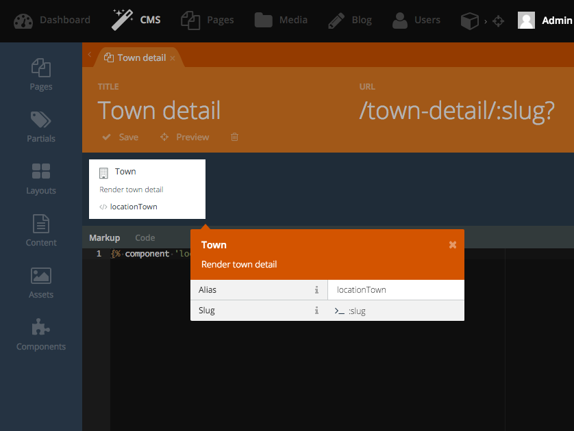
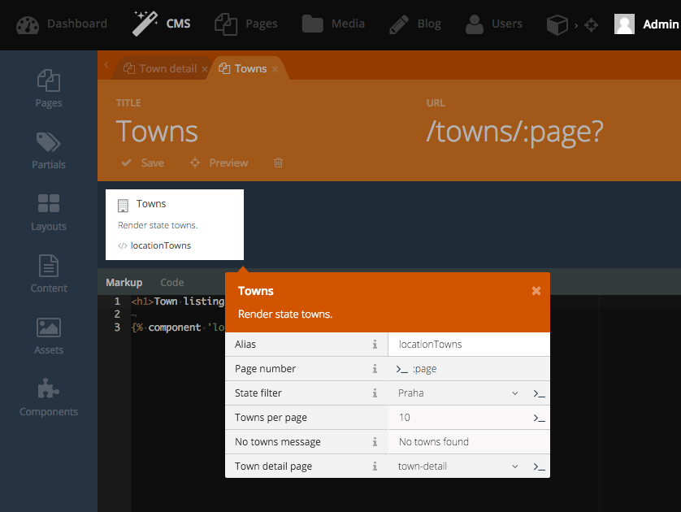

# Location Town plugin for OctoberCMS

[](https://www.codacy.com/app/vojtasvoboda/oc-locationtowns-plugin)
[](https://scrutinizer-ci.com/g/vojtasvoboda/oc-locationtowns-plugin/?branch=master)
[](https://github.com/vojtasvoboda/oc-locationtowns-plugin/blob/master/LICENSE)

Adds towns to states managed by RainLab.Location plugin. Included:

- component for state towns with pagination
- component for Town detail
- hooks for RainLab.Sitemap
- extends RainLab State model

Required plugins: RainLab.Location.

Tested with latest stable build 349.

## Render Town detail

This component render town detail. Just create page Town-detail with slug 
`/town-detail/:slug?` and insert Town component:



To override Town detail template just create partial file `/town/default.htm` as copy 
of `/plugins/vojtasvoboda/components/town/default.htm` and make own changes.

## Render list of Towns

Create page Towns with slug `/towns/:page?` where page means paginating. Insert 
component Towns. Set filter for State and select page for show Town detail 
created above:



To override Towns listing template just create partial file `/towns/default.htm` as copy 
of `/plugins/vojtasvoboda/components/towns/default.htm` and make own changes.

## Add towns to sitemap

Just install RainLab.Sitemap plugin and insert one town or all towns to sitemap:


## Services

List of available services provided by plugin:

### locationtowns service

```
$towns = App::make('locationstowns');
$town = $towns->findOneBySlug('praha');
$allTowns = $towns->all();
$townsByState = $towns->where('state_id', 285)->get();
```

### RainLab State extension

```
$state = \RainLab\Location\Models\State::find('285');
$towns = $state->towns;
```

## TODO

- !!fix fixed URL path at Town:114 and Town:129 (there should by path set in component)
- !filter only by active states in towns component
- directly extend RainLab.Location.State form to manage towns related to this state
- run plugin without RainLab.Location (only town management)
- add select box 'country' to backend listing for filtrating states
- it is not possible to do october:down
- add import and export

**Feel free to send pullrequest!**

## Contributing

Please send Pull Request to master branch.

## License

LocationTown plugin is open-sourced software licensed under the [MIT license](http://opensource.org/licenses/MIT) same as OctoberCMS platform.